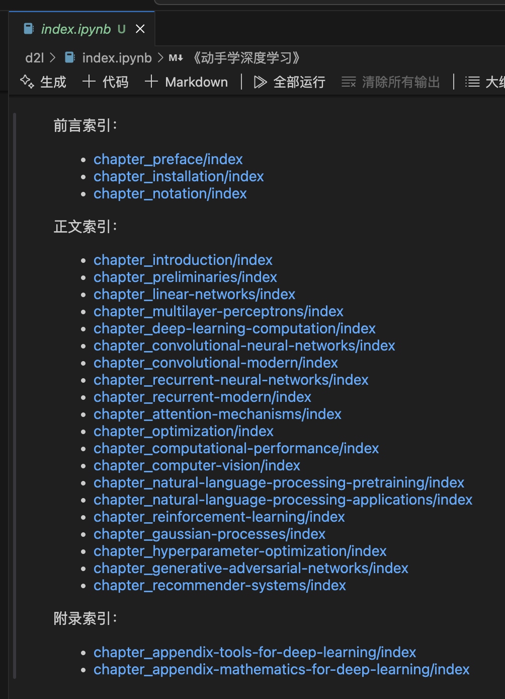
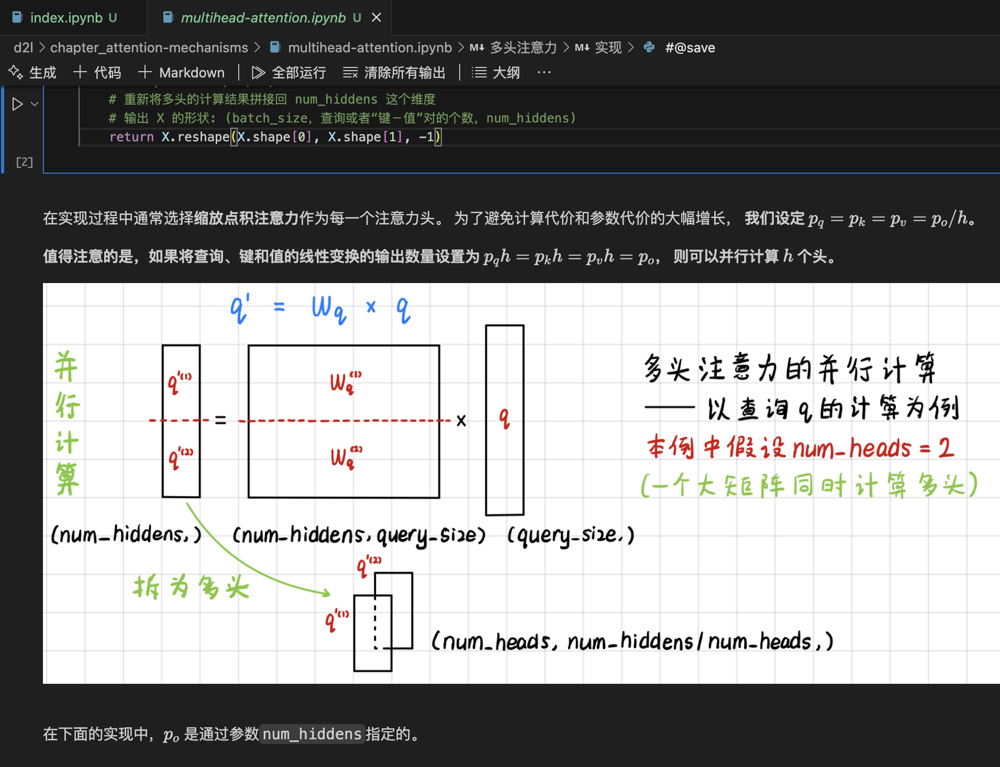
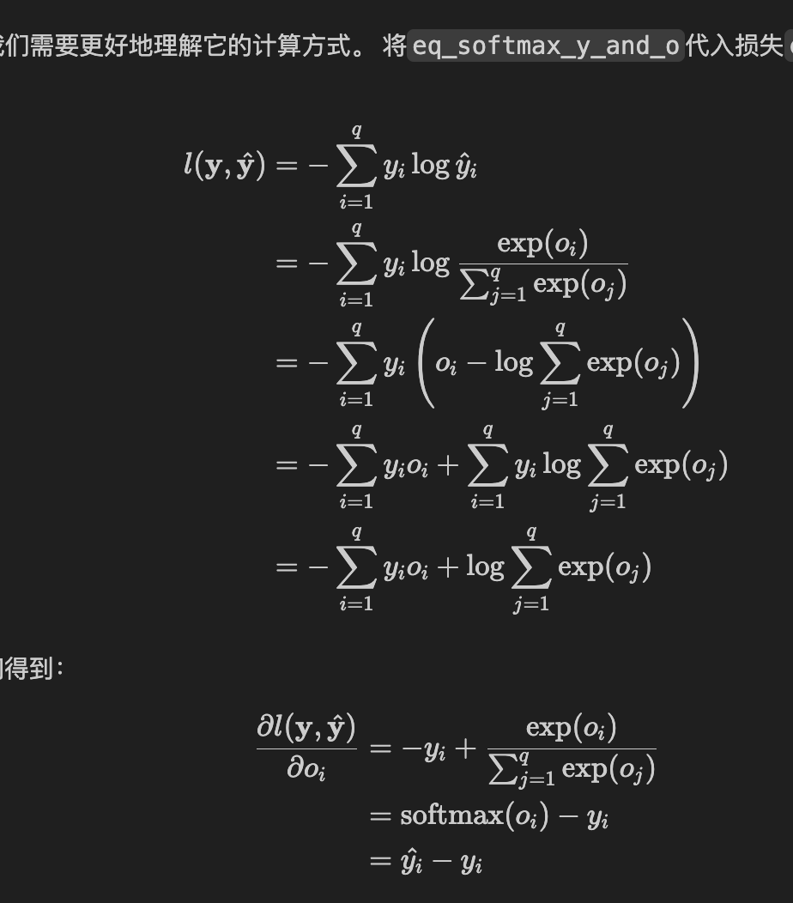
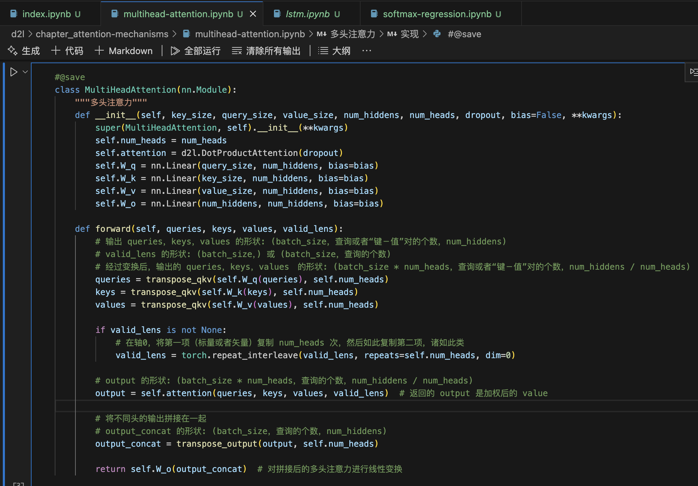

# d2l 学习笔记

## 前言

这是主包以前[动手深度学习课件](https://zh-v2.d2l.ai)的学习笔记，适合新手入门以及面试准备。

建议配合沐神的[讲解视频](https://space.bilibili.com/1567748478/lists/358497?type=series)食用，弹幕评论及每节的 QA 是精华所在。

## 主要改动

- 完善排版、添加代码注释（尤其是不常见函数以及张量维度变化）。

- 扩充公式推导，避免跳步，易于理解。

- 难点部分补充自己的理解思考，配合图表说明。

- 对重要知识点进行内容扩充，附参考资料链接提供不同角度的理解。

- 将 d2l 英文版额外的内容合并到中文版。

## 部分改动示例

1. 目录路径：[d2l/index.ipynb](d2l/index.ipynb)

  

2. 补充图表

  

3. 公式推导

  

4. 代码注释

  

